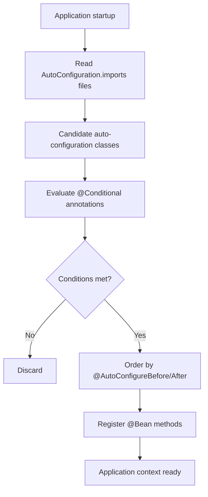

import VersionNote from '../../../../components/VersionNote.astro';

:::caution
**Draft — review pending.** Content is publication-ready in form and prose. Production-example code blocks are representative; their canonical-file links to the 1firm.app repository will be wired before this page is lifted out of draft.
:::

## What auto-configuration is

Auto-configuration is the mechanism by which Spring Boot inspects the classpath at application startup and contributes a curated set of beans for each library it recognizes. A project that adds `spring-boot-starter-web` to its dependencies receives an embedded Tomcat server, a configured `DispatcherServlet`, a Jackson `ObjectMapper`, sensible error handling, and roughly forty other beans — none of which the developer wrote, and most of which can be customized or replaced.

The mechanism is not magic. It is a pipeline: detect candidate configuration classes, evaluate conditions against the runtime context, order them according to declared precedence, and apply those whose conditions are met. Every step is deterministic, debuggable, and overridable.

## Why it matters

Auto-configuration is the feature that makes Spring Boot feel friction-free, and the feature that makes it feel inscrutable. A developer encounters it directly under three circumstances, all of which arrive in production work:

- **A bean appears that no one wrote.** A `RestTemplateBuilder`, a `MeterRegistry`, an `ObjectMapper` configured with quirks the team did not choose. Tracing it back to its auto-configuration class is the only way to understand what is wired and why.
- **A default behavior is wrong for the system.** Spring's `JacksonAutoConfiguration` produces camelCase JSON; a public API committed to snake_case must override this. Doing so without understanding the underlying mechanism produces fragile customizations that break on the next dependency upgrade.
- **A library is added and the application changes shape.** Adding `spring-boot-starter-actuator` exposes endpoints, registers metrics, and changes startup behavior — all without any explicit wiring in user code. Knowing why this happened is the difference between using Spring Boot competently and treating it as a black box.

A senior Java engineer who cannot reason about auto-configuration cannot diagnose a class of production issues that account for a meaningful share of Spring Boot's failure modes: bean conflicts, unexpected defaults, startup failures with cryptic messages about missing or duplicate beans, and dependency-induced behavior changes after upgrades.

## How it works

Spring Boot's auto-configuration runs during application context refresh, immediately after the user's `@SpringBootApplication`-annotated class is processed. The pipeline has four stages.

### Stage 1: Discovery

`@SpringBootApplication` is a meta-annotation that includes `@EnableAutoConfiguration`. The latter triggers `AutoConfigurationImportSelector`, which reads every entry under `META-INF/spring/org.springframework.boot.autoconfigure.AutoConfiguration.imports` on the classpath. Each line in such a file names a fully-qualified configuration class.

A typical Spring Boot 4.0 application discovers several hundred candidate classes at this stage — every starter on the classpath contributes its own imports file.

### Stage 2: Condition evaluation

Each candidate class is examined for `@Conditional`-family annotations: `@ConditionalOnClass`, `@ConditionalOnMissingBean`, `@ConditionalOnProperty`, `@ConditionalOnWebApplication`, and several others. Conditions are evaluated against the current `BeanFactory` and `Environment`. A class whose conditions are not all satisfied is rejected; its beans are never constructed.

This is where most of the candidates are eliminated. Of the few hundred discovered classes, only those whose required types are on the classpath, whose properties are set, and whose competing beans are absent will survive.

### Stage 3: Ordering

Surviving classes are ordered according to `@AutoConfigureBefore`, `@AutoConfigureAfter`, and `@AutoConfigureOrder` declarations. Order matters because some auto-configurations register beans that others rely on for `@ConditionalOnMissingBean` evaluation. A misordered configuration produces bean conflicts that depend on classpath iteration order — a well-known source of intermittent failures.

### Stage 4: Application

Ordered, condition-passing configuration classes are processed exactly as if the user had written `@Configuration` classes themselves. Their `@Bean` methods register beans, their `@Import`-ed configurations are pulled in, and their property bindings activate.

By the time the application context finishes refreshing, the Spring container holds the union of three bean sources: the user's own `@Component` and `@Bean` declarations, the auto-configurations whose conditions held, and any explicitly imported configurations. Auto-configuration is not a separate phase that ends; its output is interleaved with everything else.



## Production example

In a typical production Spring Boot SaaS, customization of auto-configuration takes two forms: configuration property overrides for behavior the framework already exposes, and explicit `@Configuration` classes for behavior it does not.

The first form is property-driven. A team running a public API often needs to override Jackson's default property-naming strategy regardless of how many starters are on the classpath:

```yaml
# application.yml — overrides JacksonAutoConfiguration defaults
spring:
  jackson:
    property-naming-strategy: SNAKE_CASE
    default-property-inclusion: non_null
    serialization:
      write-dates-as-timestamps: false
      indent-output: false
    deserialization:
      fail-on-unknown-properties: false
```

This file does not configure Jackson directly — it configures `JacksonAutoConfiguration`, which then configures Jackson. The auto-configuration class reads each property and applies it to the `ObjectMapper` builder. Setting these values is sufficient; no Java code is required.

The second form is structural. When the auto-configured behavior cannot be expressed as properties, the application supplies its own bean and Spring Boot's `@ConditionalOnMissingBean` ensures the framework's default does not collide:

```java
package app.config;

import com.fasterxml.jackson.databind.SerializationFeature;
import com.fasterxml.jackson.datatype.jsr310.JavaTimeModule;
import com.fasterxml.jackson.module.paramnames.ParameterNamesModule;
import org.springframework.boot.autoconfigure.jackson.Jackson2ObjectMapperBuilderCustomizer;
import org.springframework.context.annotation.Bean;
import org.springframework.context.annotation.Configuration;

@Configuration
public class JacksonConfig {

    @Bean
    Jackson2ObjectMapperBuilderCustomizer jacksonCustomizer() {
        return builder -> builder
            .modules(new JavaTimeModule(), new ParameterNamesModule())
            .failOnUnknownProperties(false)
            .featuresToDisable(SerializationFeature.WRITE_DATES_AS_TIMESTAMPS);
    }
}
```

Note the type. The bean returned is *not* an `ObjectMapper` but a `Jackson2ObjectMapperBuilderCustomizer`. This is the contract `JacksonAutoConfiguration` exposes for safe extension: it builds the `ObjectMapper`, but it applies every customizer bean before doing so. The application customizes without replacing.

Replacing the `ObjectMapper` directly is also possible, and sometimes correct, but it forfeits everything else `JacksonAutoConfiguration` would have done — module discovery, property binding, downstream consumers like `MappingJackson2HttpMessageConverter`. The customizer approach is the production default.

## Common mistakes

### Treating `@SpringBootApplication` as opaque

Developers who learn Spring Boot from quickstart guides often regard `@SpringBootApplication` as a keyword that turns on the framework. It is not. It is a meta-annotation composed of `@SpringBootConfiguration`, `@EnableAutoConfiguration`, and `@ComponentScan`. Every behavior it provides comes from one of these three. Treating the composite annotation as atomic prevents reasoning about overrides and exclusions.

### Replacing auto-configured beans with `@Bean` instead of customizing them

Defining an `ObjectMapper` bean directly causes `JacksonAutoConfiguration` to back off — its `@ConditionalOnMissingBean` sees the user-supplied bean and skips its own. This is correct when the user genuinely wants full control. It is wrong when the user wanted to change one setting and inherited the loss of every default Jackson module the framework would otherwise have registered. The customizer pattern shown in the production example is the disciplined alternative.

### Disabling auto-configuration globally to silence one class

When a single auto-configuration class causes a conflict, the temptation is to disable it via `exclude` on `@SpringBootApplication`:

```java
@SpringBootApplication(exclude = { DataSourceAutoConfiguration.class })
public class Application { /* ... */ }
```

This works, and is sometimes correct — for instance, a CLI tool that pulls in `spring-boot-starter-data-jpa` transitively but has no database. It is wrong when the underlying problem is a misconfigured property or a competing bean. Exclusion propagates: classes that depended on `DataSourceAutoConfiguration` for their own `@ConditionalOnBean` evaluations will silently change behavior. Diagnose first; exclude last.

### Assuming startup-time conditions are static

A handful of conditions, including `@ConditionalOnProperty`, evaluate against the `Environment` at the moment of context refresh. A property set later — for instance via a `@Profile`-specific configuration loaded after the auto-configuration phase — will not retroactively activate the condition. This produces surprising failures when a property is correctly set but loaded too late in the lifecycle.

### Misreading the actuator `conditions` endpoint

Spring Boot's actuator exposes `/actuator/conditions`, which reports which conditions matched and which did not. Developers who do not understand the auto-configuration pipeline misread the negative-matches list, assuming any class listed there is broken. It is not — a class appearing under "negative matches" simply did not apply, often correctly. The endpoint is a debugging tool, not an error report.

## Version notes

<VersionNote range="2.7 → 3.0">
The mechanism for declaring auto-configuration classes changed substantively. Before 2.7, candidates were listed under the `EnableAutoConfiguration` key in `META-INF/spring/spring.factories`. From 2.7 onward, the canonical location became `META-INF/spring/org.springframework.boot.autoconfigure.AutoConfiguration.imports`, with one fully-qualified class name per line. The `spring.factories` mechanism for auto-configuration was deprecated in 3.0 and removed entirely in 4.0. Custom starters built before 2.7 must migrate the imports file before working under Spring Boot 4.
</VersionNote>

<VersionNote range="3.x → 4.0">
`@ConditionalOnProperty` comparison semantics became type-aware. Earlier versions performed string comparison: `havingValue = "1"` matched a property whose literal string value was `"1"` regardless of its declared type. From 4.0 onward, the comparison respects the resolved type of the property, which affects boolean and numeric properties whose string representation in YAML or `application.properties` can be ambiguous. Conditions that worked accidentally — by string coincidence — fail under 4.0. Audit any custom auto-configuration that relies on `@ConditionalOnProperty` for boolean or numeric switches.
</VersionNote>

<VersionNote range="3.x → 4.0">
The `@AutoConfiguration` annotation, introduced in 2.7 as a specialized stereotype for auto-configuration classes, is the recommended form in 4.0. Plain `@Configuration` continues to work for application code; for libraries publishing auto-configurations to consumers, `@AutoConfiguration` is now standard and integrates cleanly with `@AutoConfigureBefore`, `@AutoConfigureAfter`, and `@AutoConfigureOrder` attributes declared directly on the annotation rather than as separate meta-annotations.
</VersionNote>

## Related concepts

- [The auto-configuration mechanism in detail](/spring-boot/auto-configuration/mechanism) — how `AutoConfigurationImportSelector` walks the classpath and what `META-INF/spring/org.springframework.boot.autoconfigure.AutoConfiguration.imports` contains.
- [Conditional annotations](/spring-boot/auto-configuration/conditions) — the `@ConditionalOn*` family in full, with evaluation rules and the type-awareness changes from 4.0.
- [Auto-configuration ordering](/spring-boot/auto-configuration/ordering) — how `@AutoConfigureBefore`, `@AutoConfigureAfter`, and `@AutoConfigureOrder` interact, and why classpath-iteration-order bugs occur without them.
- [Writing custom auto-configurations](/spring-boot/auto-configuration/custom) — how to publish a starter that contributes auto-configuration to other applications.
- [Debugging auto-configuration](/spring-boot/auto-configuration/debugging) — reading positive and negative matches from the actuator `conditions` endpoint, the `--debug` flag, and tracing why a bean did or did not appear.

---

_Official source: [Spring Boot Reference — Auto-Configuration](https://docs.spring.io/spring-boot/docs/current/reference/html/features.html#features.developing-auto-configuration). Content on this page is a derivative work based on the Spring Boot reference documentation, © VMware / Broadcom, licensed under Apache License 2.0, with modifications and additional explanation._
